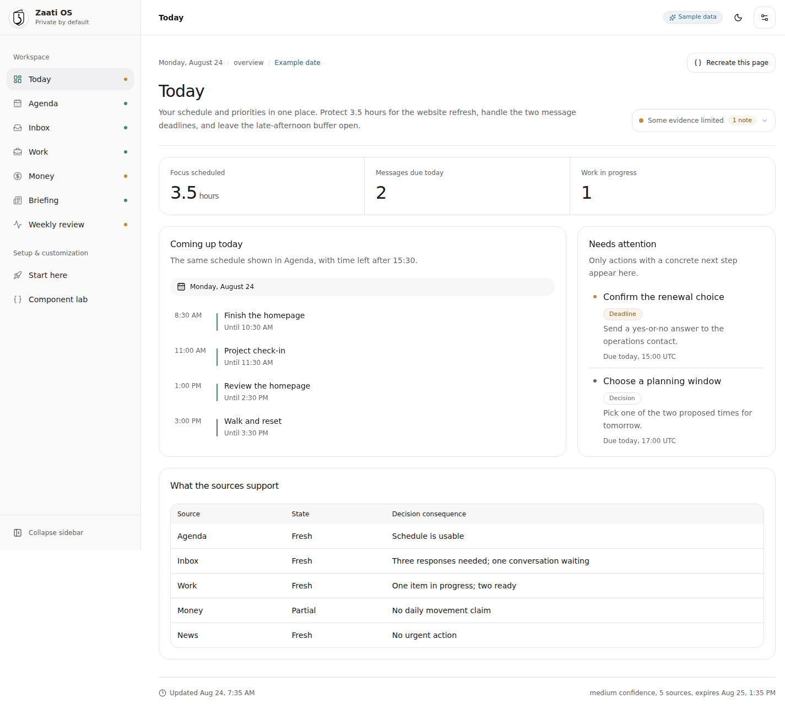
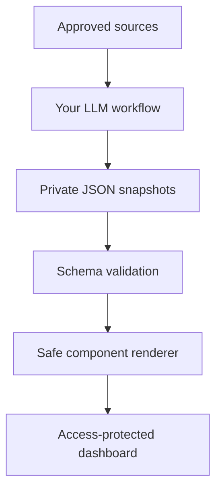

# Zaati OS

**Your life, organized by the AI you already use.**

Zaati OS is an open-source, private-by-default personal operating system. Scheduled AI workflows turn approved sources into versioned snapshots, and a schema-driven dashboard turns those snapshots into useful daily views, trends, calendars, lists, tables, and reviews.

You choose the LLM. You own the data. You control the deployment. Zaati OS has no hosted account, required telemetry, central database, or platform fee.



> The LLM is the ingestion and reasoning layer. Your private snapshot store is the durable memory. The dashboard is the interface.

## What makes it different

- **Any LLM workflow:** ChatGPT, Claude, Gemini, a local model, n8n, cron, or custom code can publish the same contract.
- **LLM-directed presentation:** A safe UI contract lets the producer request metrics, lists, timelines, calendars, line or bar charts, progress views, notices, text, and tables. The renderer only permits audited components, never arbitrary HTML or code.
- **Private by architecture:** Real snapshots are ignored in the public code repository. The recommended public-fork setup keeps data in a separate private repository and protects the deployment with Cloudflare Access.
- **Files before databases:** JSON is portable, diffable, inspectable, and easy for AI tools to create.
- **Useful failure states:** Freshness, provenance, confidence, missing sources, and warnings remain visible.
- **Forkable foundation:** The app, schemas, prompts, tests, CI, deployment recipes, theming, and synthetic examples ship together.

## Five-minute local demo

Requires Node.js 22 or newer.

```bash
git clone https://github.com/YOUR_GITHUB_USERNAME/zaati-os.git
cd zaati-os
npm install
npm run dev
```

With no private snapshots configured, Zaati OS automatically opens in clearly labeled synthetic demo mode.

## Make it yours

1. Fork the code repository. Keep it free of personal snapshots.
2. Run `npm run instance:configure` to create an ignored local instance configuration.
3. Create a separate private data repository using [the data-repository guide](docs/deployment/data-repository.md).
4. Give your LLM workflow [the contract](docs/llm-contract.md), one prompt from [`prompts/`](prompts/), and write access only to its owned snapshot path.
5. Deploy the built dashboard and put [Cloudflare Access](docs/deployment/cloudflare.md) in front of every hostname.

The shortest useful loop is three sources, for example agenda, inbox attention, and work focus, followed by the daily overview prompt.

## Data flow



No upstream Zaati OS service participates in this flow.

## Snapshot contract

Every worker owns one source and writes one deterministic dated file:

```text
data/snapshots/<domain>/<source>/<YYYY>/<MM>/<YYYY-MM-DD>.json
```

The common envelope records source identity, time period, producer, status, provenance, freshness, privacy, warnings, and domain data. The `presentation.blocks` array requests only allowlisted components.

```json
{
  "schema_version": "0.1.1",
  "snapshot_id": "agenda:primary:2030-01-15",
  "source_id": "agenda:primary",
  "generated_at": "2030-01-15T07:30:00Z",
  "status": "success",
  "privacy": { "classification": "private", "contains_personal_data": true, "synthetic": false },
  "data": {
    "title": "Tuesday agenda",
    "summary": "Two focus blocks and one decision need attention.",
    "presentation": {
      "layout": "dashboard",
      "blocks": [
        { "id": "day", "kind": "calendar", "title": "Today", "date": "2030-01-15", "events": [] }
      ]
    }
  }
}
```

See [LLM contract](docs/llm-contract.md) and [`schemas/`](schemas/) for the executable specification.

## Included starter workflows

| Prompt | Purpose | Default visualization |
| --- | --- | --- |
| `inbox-attention.md` | Extract only messages needing a decision or response | Prioritized list |
| `daily-agenda.md` | Turn calendars and tasks into a realistic day | Calendar and action list |
| `work-focus.md` | Surface owned work, blockers, and next actions | Status metrics and table |
| `money-pulse.md` | Normalize user-approved financial summaries | Metrics, line chart, notices |
| `news-briefing.md` | Keep only high-value developments | Evidence-linked list |
| `daily-overview.md` | Combine registered source snapshots | Adaptive dashboard |
| `weekly-review.md` | Find patterns and produce an evidence-based review | Progress, timeline, decisions |

These are provider-neutral templates. Copy one into any tool that can read approved sources and write JSON to the private snapshot store.

## Repository map

```text
config/               Source catalog and local instance template
data/examples/         Synthetic snapshots used by demo mode
data/snapshots/        Ignored local private snapshots
docs/                  Architecture, privacy, setup, extension, deployment
prompts/               Provider-neutral LLM workflow templates
schemas/               Executable registry, envelope, domain, and UI contracts
scripts/               Validation, indexing, setup, and source scaffolding
src/                   React, shadcn, Tailwind, and safe block renderer
deployments/           Optional infrastructure recipes
.github/workflows/     CI, security, release, and Cloudflare deployment
```

## Privacy model

A public fork is code, not a diary. Real snapshots, instance configuration, connector exports, secrets, and generated dashboard data are ignored. CI rejects committed private snapshot paths and common secret shapes. Synthetic examples are visibly marked and schema-validated.

The dashboard is a static bundle. That bundle contains the snapshot facts needed for display, so it must be treated as private even if the source repository is public. The recommended deployment disables public `workers.dev` and preview URLs, then requires Cloudflare Access on a custom hostname before data deployment.

Read [Privacy and threat model](docs/privacy.md) before connecting a real source.

## Commands

| Command | Result |
| --- | --- |
| `npm run dev` | Build the data index and start Vite |
| `npm run instance:configure` | Create ignored local settings |
| `npm run source:add` | Scaffold a source catalog entry and worker prompt |
| `npm run data:validate` | Validate registries, snapshots, ownership, and UI blocks |
| `npm run privacy:validate` | Reject private paths and common credential shapes |
| `npm run check` | Run validation, type checking, production build, and tests |
| `npm run deploy` | Validate, build, and deploy with Wrangler |

## Deployment choices

- **Recommended:** Cloudflare Workers static assets on a custom domain protected by Cloudflare Access.
- **Supported:** Any private static host that provides real authentication before serving assets.
- **Not recommended for real data:** Public GitHub Pages, unauthenticated preview URLs, or relying on an obscure URL.

Zaati OS charges no platform fee and can be deployed using free or already-owned tools, depending on provider, connector, model, storage, and hosting choices.

## Release

Current version: **v0.1.1**

This release establishes the portable data contract, adaptive component renderer, starter prompts, synthetic demo, privacy boundaries, Cloudflare recipe, CI, and contribution model. See [CHANGELOG.md](CHANGELOG.md).

## Contributing

Contributions should be composable domain packs with a source entry, schema, prompt, synthetic fixture, rendering behavior, tests, privacy notes, and removal steps. Maintainers must never need real personal data to review a contribution.

Read [CONTRIBUTING.md](CONTRIBUTING.md), [CODE_OF_CONDUCT.md](CODE_OF_CONDUCT.md), and [SECURITY.md](SECURITY.md).

The long-term product direction is captured in [Product vision](docs/product-vision.md) and [Roadmap](docs/roadmap.md).

Repository owners should complete the one-time [Maintainer setup](docs/maintainer-setup.md) after the first merge.

## License

Licensed under the [Apache License 2.0](LICENSE). It provides clear reuse rights and an explicit patent grant for an ecosystem intended to be forked and extended.
