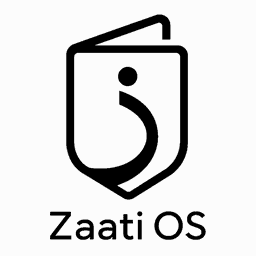
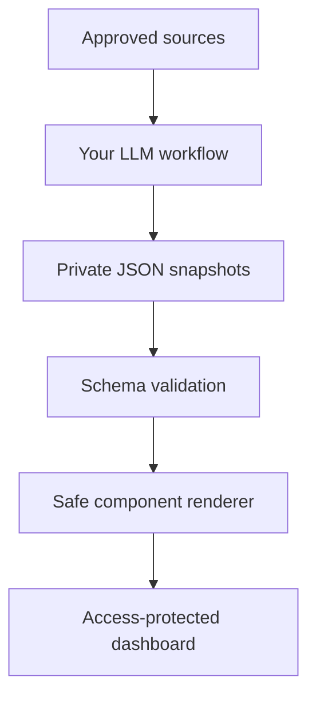

<p align="center">
  
</p>

# Zaati OS

[](../../actions/workflows/ci.yml)
[](../../actions/workflows/codeql.yml)

**Your life, organized by the AI you already use.**

Zaati OS is an open-source, private-by-default personal operating system. Scheduled AI workflows turn approved sources into versioned snapshots, and a schema-driven dashboard turns those snapshots into useful daily views, trends, calendars, lists, tables, and reviews.

You choose the LLM. You own the data. You control the deployment. Zaati OS has no hosted account, required telemetry, central database, or platform fee.


> The LLM is the ingestion and reasoning layer. Your private snapshot store is the durable memory. The dashboard is the interface.

## What makes it different

- **Any LLM workflow:** ChatGPT, Claude, Gemini, a local model, n8n, cron, or custom code can publish the same contract.
- **LLM-directed presentation:** A safe UI contract lets the producer request metrics, lists, timelines, calendars, line or bar charts, progress views, notices, text, and tables. The renderer only permits audited components, never arbitrary HTML or code.
- **Private by architecture:** Real snapshots are ignored in the public code repository. The recommended public-fork setup keeps data in a separate private repository and protects the deployment with Cloudflare Access.
- **Files before databases:** JSON is portable, diffable, inspectable, and easy for AI tools to create.
- **Useful failure states:** Freshness, provenance, confidence, missing sources, and warnings remain visible.
- **Forkable foundation:** The app, schemas, prompts, tests, CI, deployment recipes, theming, and synthetic examples ship together.

## Three steps, then voila

Requires Node.js 22 or newer.

```bash
git clone https://github.com/YOUR_GITHUB_USERNAME/zaati-os.git
cd zaati-os
npm install
npm run setup
npm run tutorial
```

The setup assistant creates ignored local preferences. The tutorial runs a credential-free mock LLM that deliberately fails its first contract attempt, retries safely, creates six synthetic snapshots in one transaction, and opens the dashboard.

Prefer Make?

```bash
make setup
make tutorial
```

## Make it yours

1. Fork the code repository and run `npm run setup`.
2. Test the entire ingestion loop with `npm run tutorial`.
3. Give one scheduled LLM workflow [`prompts/daily-bundle.md`](prompts/daily-bundle.md) and its approved tools, then publish all snapshots in one private commit.

Everything else, including custom sources, encrypted storage, full theme tokens, and automatic deployment, is optional and documented separately.

The shortest useful loop is three sources, for example agenda, inbox attention, and work focus, followed by the daily overview prompt.

## Data flow



No upstream Zaati OS service participates in this flow.

## One run, many snapshots

`schemas/snapshot-bundle.schema.json` lets one LLM run produce up to 20 registered snapshots. Zaati OS validates the entire bundle, sends concise contract errors back for up to three attempts, and writes nothing until every nested snapshot passes. Valid bundles are persisted as one rollback-safe local transaction or one Git commit.

This is especially useful for scheduled AI products where active task capacity is limited. One daily task can refresh agenda, inbox, work, money, news, and the overview instead of consuming one task per source. Start with the [one-task tutorial](docs/tutorials/one-task-daily-bundle.md).

## Snapshot contract

Every worker owns one source and writes one deterministic dated file:

```text
data/snapshots/<domain>/<source>/<YYYY>/<MM>/<YYYY-MM-DD>.json
```

The common envelope records source identity, time period, producer, status, provenance, freshness, privacy, warnings, and domain data. The `presentation.blocks` array requests only allowlisted components.

```json
{
  "schema_version": "0.1.1",
  "snapshot_id": "agenda:primary:2030-01-15",
  "source_id": "agenda:primary",
  "generated_at": "2030-01-15T07:30:00Z",
  "status": "success",
  "privacy": { "classification": "private", "contains_personal_data": true, "synthetic": false },
  "data": {
    "title": "Tuesday agenda",
    "summary": "Two focus blocks and one decision need attention.",
    "presentation": {
      "layout": "dashboard",
      "blocks": [{ "id": "day", "kind": "calendar", "title": "Today", "date": "2030-01-15", "events": [] }]
    }
  }
}
```

See [LLM contract](docs/llm-contract.md) and [`schemas/`](schemas/) for the executable specification.

## Included starter workflows

| Prompt               | Purpose                                              | Default visualization         |
| -------------------- | ---------------------------------------------------- | ----------------------------- |
| `inbox-attention.md` | Extract only messages needing a decision or response | Prioritized list              |
| `daily-agenda.md`    | Turn calendars and tasks into a realistic day        | Calendar and action list      |
| `work-focus.md`      | Surface owned work, blockers, and next actions       | Status metrics and table      |
| `money-pulse.md`     | Normalize user-approved financial summaries          | Metrics, line chart, notices  |
| `news-briefing.md`   | Keep only high-value developments                    | Evidence-linked list          |
| `daily-overview.md`  | Combine registered source snapshots                  | Adaptive dashboard            |
| `weekly-review.md`   | Find patterns and produce an evidence-based review   | Progress, timeline, decisions |

These are provider-neutral templates. Copy one into any tool that can read approved sources and write JSON to the private snapshot store.

## Repository map

```text
config/               Source, workflow, and local instance configuration
data/examples/         Synthetic snapshots used by demo mode
data/snapshots/        Ignored local private snapshots
docs/                  Architecture, privacy, setup, extension, deployment
prompts/               Provider-neutral LLM workflow templates
public/data/            Ignored build-time dashboard payload
schemas/               Executable registry, envelope, domain, and UI contracts
scripts/               Validation, indexing, setup, and source scaffolding
src/                   React, shadcn, Tailwind, and safe block renderer
deployments/           Optional infrastructure recipes
.github/workflows/     CI, security, release, and Cloudflare deployment
```

## Privacy model

A public fork is code, not a diary. Real snapshots, instance configuration, connector exports, secrets, and generated dashboard data are ignored. CI rejects committed private snapshot paths and common secret shapes. Synthetic examples are visibly marked and schema-validated.

Optional AES-256-GCM snapshot encryption protects files at rest with a key supplied only through an ignored local key file or protected deployment secret. It is feature flagged and off by default. Encryption does not replace Access because authorized builds and browsers must eventually decrypt displayed facts.

The dashboard is a static bundle. That bundle contains the snapshot facts needed for display, so it must be treated as private even if the source repository is public. The recommended deployment disables public `workers.dev` and preview URLs, then requires Cloudflare Access on a custom hostname before data deployment.

Read [Privacy and threat model](docs/privacy.md) before connecting a real source.

## Commands

| Command                      | Result                                                                         |
| ---------------------------- | ------------------------------------------------------------------------------ |
| `npm run dev`                | Build the data index and start Vite                                            |
| `npm run setup`              | Complete the guided three-step local setup                                     |
| `npm run tutorial`           | Run the retrying mock LLM bundle and open it locally                           |
| `npm run workflow:run`       | Connect any command-based LLM adapter                                          |
| `npm run snapshot:ingest`    | Atomically validate and persist one multi-snapshot bundle                      |
| `npm run snapshot:keygen`    | Create an ignored 256-bit snapshot key                                         |
| `npm run instance:configure` | Create ignored local settings                                                  |
| `npm run source:add`         | Scaffold a source catalog entry and worker prompt                              |
| `npm run data:validate`      | Validate registries, snapshots, ownership, and UI blocks                       |
| `npm run privacy:validate`   | Reject private paths and common credential shapes                              |
| `npm run format:check`       | Reject formatting drift with Prettier                                          |
| `npm run lint`               | Run type-aware ESLint, React Hooks, and React Refresh rules                    |
| `npm run test:coverage`      | Run tests with enforced line, branch, and function coverage                    |
| `npm run check`              | Run contracts, security, build, retry, encryption, performance, and WCAG tests |
| `npm run deploy`             | Validate, build, and deploy with Wrangler                                      |

## Enforced quality gates

The badges at the top of this README reflect the current default-branch CI and CodeQL results. A red badge means the published branch is failing a real check, not that someone forgot to update a status table.

| Gate                  | Enforced standard                                                                                                  |
| --------------------- | ------------------------------------------------------------------------------------------------------------------ |
| Formatting            | Zero Prettier drift                                                                                                |
| Static analysis       | Zero ESLint errors or warnings, strict TypeScript build                                                            |
| Repository policy     | Exact dependency versions, valid workflow YAML, timeouts, least-privilege permissions, safe checkout configuration |
| Contracts and privacy | Every registry, snapshot, schema, ownership rule, deployment boundary, and committed path validates                |
| Unit coverage         | At least 90% lines, 78% branches, and 80% functions across the ingestion and encryption core                       |
| Performance           | At most 120 KB JavaScript gzip, 20 KB CSS gzip, and 120 KB dashboard data gzip                                     |
| Accessibility         | Zero axe WCAG A or AA violation groups across tutorial and dashboard, light, dark, desktop, and mobile             |
| Security              | Zero high-severity npm audit findings plus CodeQL analysis                                                         |

Pull requests expose each gate as a separate job and finish with one `Quality gate` result suitable for branch protection. Run `npm run check` locally for the same product checks before pushing.

## Deployment choices

- **Recommended:** Cloudflare Workers static assets on a custom domain protected by Cloudflare Access.
- **Supported:** Any private static host that provides real authentication before serving assets.
- **Not recommended for real data:** Public GitHub Pages, unauthenticated preview URLs, or relying on an obscure URL.

Zaati OS charges no platform fee and can be deployed using free or already-owned tools, depending on provider, connector, model, storage, and hosting choices.

## Release

Current version: **v0.1.1**

This release establishes the portable data contract, atomic bundle ingestion, adaptive renderer, guided onboarding, provider adapters, optional encrypted storage, theme studio, privacy boundaries, Cloudflare recipe, and CI quality gates. See [CHANGELOG.md](CHANGELOG.md).

## Contributing

Contributions should be composable domain packs with a source entry, schema, prompt, synthetic fixture, rendering behavior, tests, privacy notes, and removal steps. Maintainers must never need real personal data to review a contribution.

Read [CONTRIBUTING.md](CONTRIBUTING.md), [CODE_OF_CONDUCT.md](CODE_OF_CONDUCT.md), and [SECURITY.md](SECURITY.md).

The long-term product direction is captured in [Product vision](docs/product-vision.md) and [Roadmap](docs/roadmap.md).

Repository owners should complete the one-time [Maintainer setup](docs/maintainer-setup.md) after the first merge.

## License

Licensed under the [Apache License 2.0](LICENSE). It provides clear reuse rights and an explicit patent grant for an ecosystem intended to be forked and extended.
