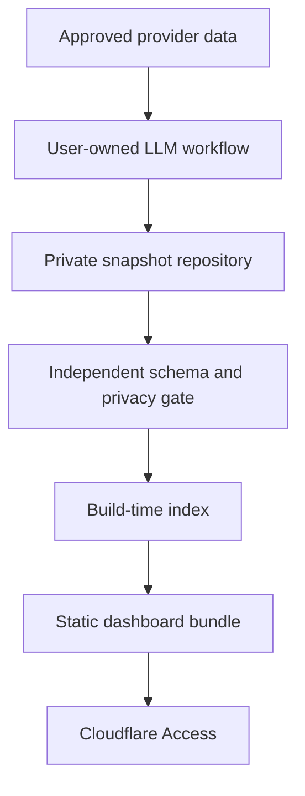

# Architecture

## System boundary

Zaati OS does not run a hosted ingestion service. The public project never needs access to an inbox, calendar, account, workflow, model, or private snapshot.

## Layers

### Source catalog

`config/sources.json` defines stable IDs, worker ownership, prompts, schemas, cadence, freshness, dependencies, target paths, authorized inputs, and forbidden inputs. It describes reusable source capabilities, not one person's connections.

`config/workflows.json` groups registered source IDs into maintainable runs. It defines the prompt, bounded attempts, and atomic publication style without storing provider credentials or personal configuration.

### Snapshot envelope

`schemas/snapshot.schema.json` carries identity, effective period, producer, evidence sources, status, freshness, quality, privacy, and a domain payload. One file represents one source for one effective date.

### Durable facts and safe presentation

Each source has a domain facts schema for durable memory. `schemas/ui-blocks.schema.json` is a separate executable view model. The producer may derive audited blocks from facts, but cannot send code or arbitrary components. React maps every allowed `kind` to a maintained renderer.

### Private memory

Snapshots use deterministic paths. Source workers write independently, so one unavailable provider does not corrupt another domain. Git can provide history, review, correction, and rollback when the data repository is private.

### Build index

`scripts/build-data-index.mjs` discovers snapshots, decrypts encrypted files in memory when enabled, selects the latest enabled source, and writes an ignored `public/data/dashboard-data.json`. The upstream example configuration explicitly enables demo mode and may use public synthetic examples when private snapshots are absent. An ignored local configuration created by setup defaults to private mode, never falls back to example snapshots, and omits Component Lab data and demo prompt guides. The browser never receives repository credentials or the decryption key.

### Static interface

Vite builds a client-only shell and a separate no-store dashboard payload. Hashed application assets can be cached without baking personal facts into the JavaScript chunk. The data response is still plaintext for an authorized browser and remains private. Authentication belongs in front of every asset, not in client-side JavaScript.

### Bundle transaction and publication gate

One LLM run may return a versioned bundle containing several snapshots. Zaati OS validates the authoritative source set, identities, schemas, source ownership, privacy guards, and domain payloads before writing. Local persistence uses per-file atomic renames plus rollback backups. Git-backed workflows open one pull request. A separate workflow in the private data repository validates the candidate before merge, so the producing LLM is not its own trust authority.

### Optional encrypted storage

When `storage.snapshot_encryption` is enabled, snapshot paths use `.json.enc` authenticated envelopes. AES-256-GCM detects tampering and keeps plaintext out of the repository and local snapshot directory. Decryption happens in process memory during validation and build. The generated dashboard payload and authorized browser view are not encrypted at rest by this feature.

## Aggregates

A source worker reads one approved external system. An aggregate worker reads only registered dependency snapshots. The daily overview and weekly review are aggregates. They reference snapshot IDs and preserve dependency warnings.

## Failure model

- unavailable input remains unavailable
- stale input remains stale
- partial output carries warnings and reduced confidence
- failed output may still preserve the last successful snapshot in history
- missing sources never become zero
- an empty block renders an honest empty state

## Extension boundary

Most new capabilities need one catalog entry, prompt, domain schema or the generic schema, synthetic fixture, and existing UI blocks. Core application code changes only when the information requires a genuinely new interaction.
