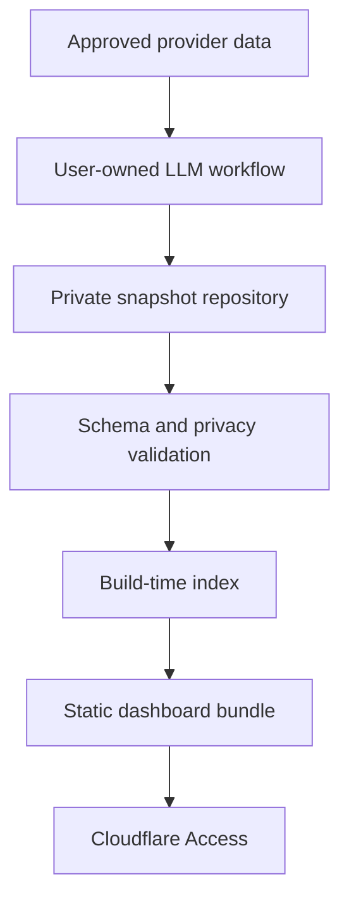

# Architecture

## System boundary

Zaati OS does not run a hosted ingestion service. The public project never needs access to an inbox, calendar, account, workflow, model, or private snapshot.

## Layers

### Source catalog

`config/sources.json` defines stable IDs, worker ownership, prompts, schemas, cadence, freshness, dependencies, target paths, authorized inputs, and forbidden inputs. It describes reusable source capabilities, not one person's connections.

### Snapshot envelope

`schemas/snapshot.schema.json` carries identity, effective period, producer, evidence sources, status, freshness, quality, privacy, and a domain payload. One file represents one source for one effective date.

### Safe presentation

`schemas/ui-blocks.schema.json` is an executable view model. The producer may choose among audited blocks, but cannot send code or arbitrary components. React maps every allowed `kind` to a maintained renderer.

### Private memory

Snapshots use deterministic paths. Source workers write independently, so one unavailable provider does not corrupt another domain. Git can provide history, review, correction, and rollback when the data repository is private.

### Build index

`scripts/build-data-index.mjs` discovers snapshots, selects the latest enabled source, and writes an ignored frontend index. When private snapshots are absent it uses the synthetic examples. The browser never receives repository credentials.

### Static interface

Vite builds a client-only bundle. This keeps hosting simple, but the bundle contains displayed facts and is therefore private. Authentication belongs in front of the assets, not in client-side JavaScript.

## Aggregates

A source worker reads one approved external system. An aggregate worker reads only registered dependency snapshots. The daily overview and weekly review are aggregates. They reference snapshot IDs and preserve dependency warnings.

## Failure model

- unavailable input remains unavailable
- stale input remains stale
- partial output carries warnings and reduced confidence
- failed output may still preserve the last successful snapshot in history
- missing sources never become zero
- an empty block renders an honest empty state

## Extension boundary

Most new capabilities need one catalog entry, prompt, domain schema or the generic schema, synthetic fixture, and existing UI blocks. Core application code changes only when the information requires a genuinely new interaction.
