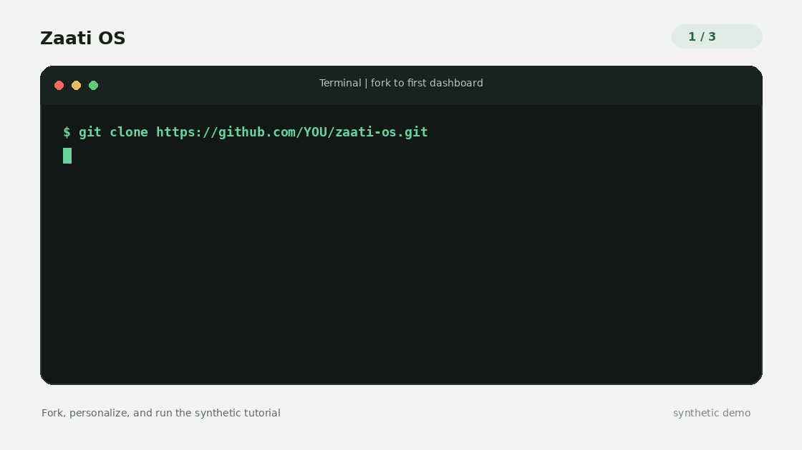
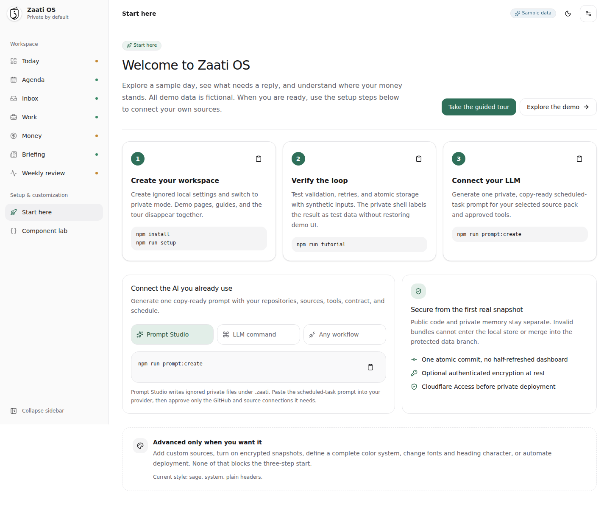
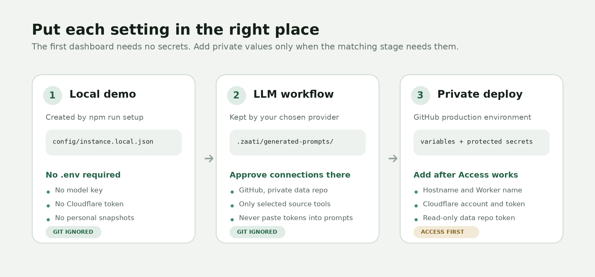
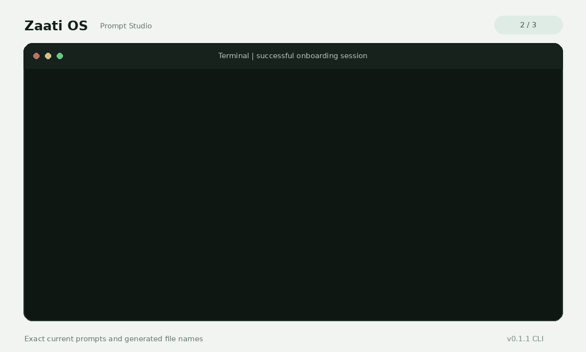
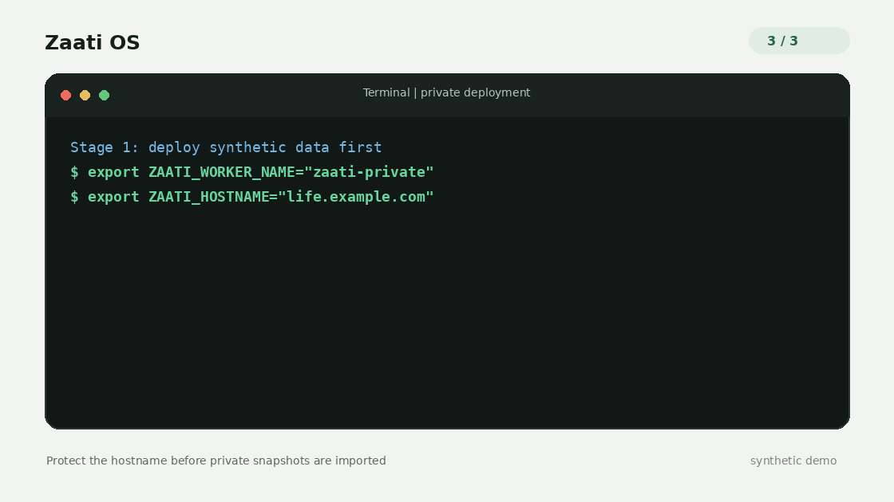

# Onboarding

This is the complete path from a fresh fork to a private Zaati OS dashboard powered by the LLM you already use.

You will end with:

- a public code fork that stays safe to share
- a separate private repository for personal snapshots
- one scheduled LLM workflow that refreshes several sources together
- a private dashboard protected by Cloudflare Access

> Want to look around first? Run `npm run dev` before setup. The public synthetic demo includes an optional guided tour, Component Lab, and example prompt guides without credentials, provider accounts, `.env` files, or personal data.

## The journey

| Stage               | What you do                                   | What Zaati OS creates                        |
| ------------------- | --------------------------------------------- | -------------------------------------------- |
| 1. Test drive       | Explore the demo, tour, sources, and blocks   | A local dashboard with public synthetic data |
| 2. Go private       | Run setup, then verify the ingestion tutorial | An ignored workspace without demo-only UI    |
| 3. Connect your LLM | Generate and paste one private task prompt    | Validated snapshots in a private repository  |
| 4. Deploy safely    | Protect a hostname, then connect private data | Your private, always-available dashboard     |

## Before you start

You need:

- [Git](https://git-scm.com/downloads)
- [Node.js 22 or newer](https://nodejs.org/)
- a GitHub account
- an LLM or automation environment that can use your approved sources and write to GitHub
- a Cloudflare account and custom domain only when you are ready to deploy

The contract is provider-neutral, but Zaati OS does not bundle source connectors. ChatGPT scheduled tasks are the target first real workflow, with recorded release evidence still pending. Other capable LLMs, local models, n8n, cron, and custom commands can use the same contract when they already have the required approved tools.

## 1. Fork, clone, and personalize

Fork [`mohsinht/zaati-os`](https://github.com/mohsinht/zaati-os), then clone your fork:

```bash
git clone https://github.com/YOUR_GITHUB_USERNAME/zaati-os.git
cd zaati-os
npm install
npm run dev
```

The first visit offers a five-step tour. You can skip it immediately or reopen it from **Start here**. It explains registered sources, the safe JSON-to-component contract, the example prompt guides, and the private handoff.

When you are ready, stop the development server and run:

```bash
npm run setup
```

The setup assistant asks for your dashboard name, timezone, currency, starter sources, theme, and optional encrypted snapshot storage. It writes `config/instance.local.json`, which is ignored by Git and uses private file permissions. This local configuration switches the workspace to private mode, so synthetic example pages, Component Lab, copy-prompt guides, and the automatic tour all disappear together.



Good starter choices:

| Question    | Recommended first answer                                      |
| ----------- | ------------------------------------------------------------- |
| Source pack | `daily`                                                       |
| Palette     | `sage`                                                        |
| Font        | `system`                                                      |
| Headers     | `plain`                                                       |
| Encryption  | `no` for the synthetic tutorial, decide before real snapshots |

Rerun the wizard later with `npm run setup -- --force`.

## 2. Run the synthetic tutorial

```bash
npm run tutorial
```

The tutorial uses a credential-free mock LLM. It deliberately produces an invalid bundle once, receives safe validation feedback, retries, creates six synthetic snapshots atomically, and opens the local dashboard.



Nothing personal is written. The resulting pages are labeled **Synthetic test data**, but demo-only navigation and guides stay disabled. If this screen opens, the complete local ingestion and rendering loop works.

## 3. Create the private memory repository

Create a new private GitHub repository, for example `YOUR_GITHUB_USERNAME/zaati-data`. Do not fork the public code repository for this.

The LLM workflow will maintain this shape:

```text
data/
  snapshots/
    <domain>/
      <source>/
        <YYYY>/<MM>/<YYYY-MM-DD>.json
```

Your code fork can stay public. Your data repository must stay private. Install its independent validation gate before connecting an LLM:

```bash
npm run data-repository:init -- --target ../zaati-data --code-repository YOUR_GITHUB_USERNAME/zaati-os --code-ref FULL_COMMIT_SHA
```

Commit the generated files and require `Validate Zaati snapshots` in branch protection. See [Private data repository](deployment/data-repository.md) for permissions, encryption, retention, and same-day reruns.

## 4. Understand the environment setup



There is no required `.env` file for the local demo. `.env.example` is a reference for optional deployment configuration.

Keep values in the system that needs them:

| Value                                 | Where it belongs                                       | Commit it? |
| ------------------------------------- | ------------------------------------------------------ | ---------- |
| Dashboard name, timezone, theme       | Ignored `config/instance.local.json`                   | No         |
| Generated LLM task prompt             | Ignored `.zaati/generated-prompts/`                    | No         |
| GitHub and source access              | Your LLM provider's connection settings                | No         |
| Hostname and Worker name              | GitHub `production` environment variables              | No         |
| Cloudflare and data repository tokens | GitHub `production` environment secrets                | No         |
| Optional snapshot key                 | Trusted local or protected CI ingestion and deployment | No         |

Never paste tokens into a generated prompt. Prefer provider-managed connections and narrow repository permissions.

## 5. Connect the LLM you already use

Generate a copy-ready task prompt:

```bash
npm run prompt:create
```



For a useful first daily task, choose:

- `agenda:primary`
- `inbox:attention`
- `work:focus`
- `overview:daily`, after its dependencies

Prompt Studio asks for a provider, a starter dashboard, the two repositories, and a schedule. It chooses registered dependencies and safe view types for the normal path.

It creates a short `.permissions.md` receipt for human review plus `.scheduled-task.md` with current contract locations, privacy limits, retries, deterministic paths, and pull-request publication rules.

### Configure the provider

In ChatGPT, Claude, Gemini, n8n, or another supported environment:

1. Connect GitHub and grant permission to create branches and pull requests only in the private data repository.
2. Connect only the source tools selected in Prompt Studio, for example calendar or email.
3. Create a task, automation, or reusable workflow.
4. Paste the complete generated scheduled-task prompt.
5. Review the generated permission receipt, repositories, sources, paths, and schedule.
6. Run it manually once before enabling recurrence.
7. Confirm that all selected snapshots arrive in one pull request and the independent check passes.

The provider must read the current default branch contracts on every run. A copied prompt alone is not permanent authority to ignore newer schemas.

### Verify the first real run

Check the private repository, not the public fork. A successful run should:

- write only registered dated snapshot paths
- update all selected sources together
- contain no credentials, raw provider exports, or unnecessary personal content
- preserve missing values, uncertainty, provenance, and warnings
- leave no mergeable pull request if one snapshot fails
- stop without merging its own pull request

Pull-request publication and the independent validator are required for scheduled Git workflows.

### Local command alternative

If your LLM is exposed as a command that prints the exact JSON bundle:

```bash
your-llm-command | npm run snapshot:ingest -- --output-dir data/snapshots
```

See [Local command adapter](tutorials/local-command-adapter.md).

## 6. Preview real snapshots locally

Keep the real files under ignored `data/snapshots/`, or point `ZAATI_DATA_DIR` to a private local checkout, then run:

```bash
npm run data:validate
npm run dev
```

The browser receives the facts required to render the dashboard. Treat the local session and every production hostname as private.


## 7. Deploy privately

The safe order matters: deploy synthetic data, protect the hostname, verify Access from outside your session, then connect private snapshots.



### A. Create the protected GitHub environment

In your code fork, create an environment named `production`.

Add these environment variables:

| Variable                | Purpose                                      |
| ----------------------- | -------------------------------------------- |
| `ZAATI_WORKER_NAME`     | Cloudflare Worker name                       |
| `ZAATI_HOSTNAME`        | Exact custom hostname                        |
| `ZAATI_ACCESS_VERIFIED` | Set to `true` only after verification        |
| `ZAATI_DATA_REPOSITORY` | Optional private repository, `owner/name`    |
| `ZAATI_DATA_REF`        | Private data branch, normally `main`         |
| `ZAATI_AUTO_DEPLOY`     | Enable only after a manual deployment passes |

Add these environment secrets:

| Secret                        | Purpose                                         |
| ----------------------------- | ----------------------------------------------- |
| `CLOUDFLARE_ACCOUNT_ID`       | Target Cloudflare account                       |
| `CLOUDFLARE_API_TOKEN`        | Scoped Workers edit token                       |
| `ZAATI_DATA_REPOSITORY_TOKEN` | Read-only access to one private data repository |
| `ZAATI_INSTANCE_CONFIG_JSON`  | Optional complete instance configuration        |
| `ZAATI_SNAPSHOT_KEY`          | Optional key for encrypted snapshot storage     |

### B. Deploy synthetic data

Leave `ZAATI_DATA_REPOSITORY` unset. Run the `Deploy private dashboard` GitHub Actions workflow manually.

### C. Protect and verify the hostname

Create a Cloudflare Access self-hosted application for the exact hostname. Use exact email addresses or a constrained identity group, then test both an authorized browser and an incognito browser.

```bash
npm run access:verify -- life.example.com
```

The command must detect an unauthenticated Access challenge or denial for HTML, dashboard data, and an asset path.

### D. Connect private data

Set the private data repository variable and its read-only token, set `ZAATI_ACCESS_VERIFIED=true`, then run the deployment workflow again. Only enable `ZAATI_AUTO_DEPLOY=true` after this manual run passes.

Read [Private Cloudflare deployment](deployment/cloudflare.md) for token scopes, Access policy guidance, encryption, caching, and rollback.

## Go-live checklist

- [ ] The code fork contains no real snapshots or local instance file.
- [ ] The data repository is private and its independent validator is required.
- [ ] The LLM has only the GitHub and source access it needs.
- [ ] One manual bundle run succeeded before scheduling.
- [ ] The dashboard shows freshness, provenance, and honest missing states.
- [ ] Cloudflare Access challenges an incognito visitor.
- [ ] `npm run access:verify -- <hostname>` passes.
- [ ] Private snapshots were connected only after Access verification.
- [ ] `npm run check` passes before application changes are merged.

## Where to go next

- [Prompt Studio](prompt-studio.md), tune or automate prompt generation
- [One-task daily bundle](tutorials/one-task-daily-bundle.md), refresh several domains in one run
- [Add a domain](adding-a-domain.md), teach Zaati OS a new source
- [Encrypted snapshots](tutorials/encrypted-snapshots.md), protect repository copies at rest
- [Theme Studio](tutorials/theme-studio.md), personalize the interface
- [Troubleshooting](troubleshooting.md), diagnose common setup and deployment issues
