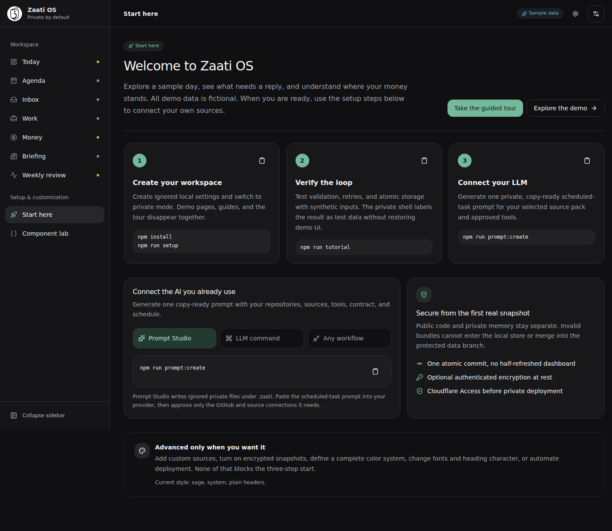
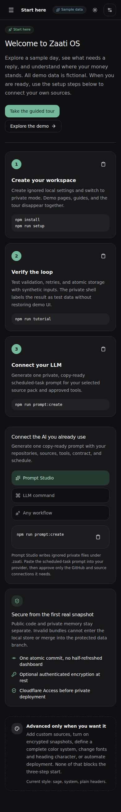

# Screenshots

All screenshots are captured from schema-validated synthetic demo data.

## Guided start, light

## Guided start, dark

## Guided start, mobile

## Desktop, light

## Desktop, dark

## Mobile

## Terminal animations

The onboarding GIFs are readable terminal transcripts, not promotional slides. Each animation must:

- use commands, prompts, generated paths, and output messages from the current CLI
- append output in execution order and scroll only when the terminal viewport fills
- show answers on the prompt that requested them
- distinguish shell comments from program output
- omit machine-specific package-manager notices that do not teach the workflow
- never invent a successful validation, deployment, or publication result
- use only generic repositories, example hostnames, and synthetic values

Review all three animations whenever setup prompts, Prompt Studio, deployment commands, or their success messages change.

### Setup and tutorial

### Prompt Studio

### Cloudflare Access verification

Never replace these with a capture from a private deployment.
